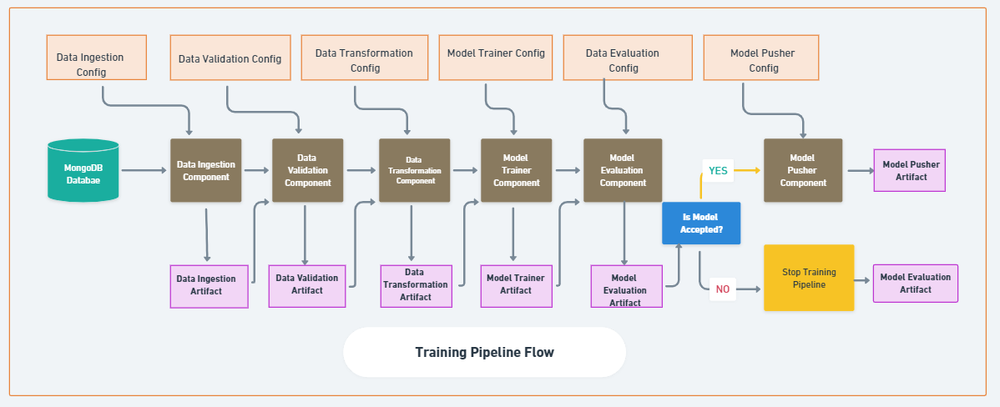

# Title: Insurance premium Price Prediction

## Problem Statement:
**The goal of this project is to give people an estimate of how much they need based on
their individual health situation. After that, customers can work with any health 
insurance carrier and its plans and perks while keeping the projected cost from our 
study in mind. This can assist a person in concentrating on the health side of an 
insurance policy rather than the ineffective part. Also Insurace provider companies can 
use this model to get health expenses of an individual based on attribute values so that
they can design and provide personlised premium plan to particuler customer**




## To run this project, follow the steps:

### Download the dataset:
 You can download dataset by using [Dataset Download link](https://www.kaggle.com/noordeen/insurance-premium-prediction)

### Open git bash terminal and Clone the github repository in your local directory:
run
```
git clone https://github.com/dkg0101/Insurance-Premium-Prediction.git
```


### Create virtual environment in project directory:
Open the terminal and run:
```
conda create -p <envName> python==3.8 -y

conda activate ./<envName>
```
Install the requirements by running `pip install -r requirements.txt`


### Now Create Mongodb account and form a cluster:
You can use this [link](https://www.mongodb.com/cloud/atlas/register) to create a account
after registration and creating cluster,
Create database = 'ineuron'
Create collection = 'insurance'


### first, dump the data into MongoDB collection:
Set following environment variable in your local system
key - "MONGO_DB_URL"
value - mongodb+srv://<username>:<password>@cluster0.jys9xir.mongodb.net/?retryWrites=true&w=majority
> [!WARNING]
> 	**Always Keep your _MongoDB connection url_  private**

After setting environment variables run following command in terminal
```
python data_dump.py
```


### Run the trainig pipeline locally :
run,
```python main.py
```

### Make predictions through API
run `python app.py`

check the **_logs_** directory to get url and open it using any browser


